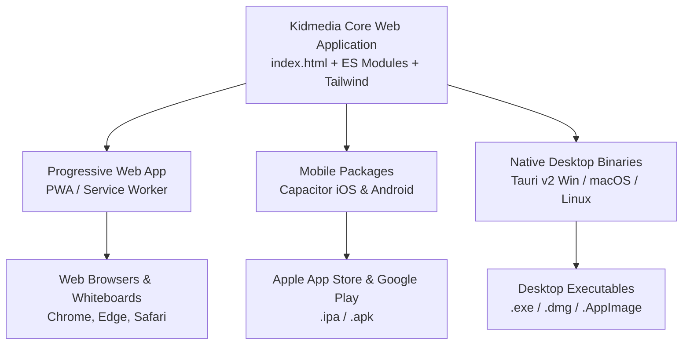

# Master Technical Standard 01: Tech Stack & Directory Structure

> **Organization**: Kidmedia Special Education Web Apps  
> **Document Status**: Official Specification Standard  
> **Language**: English  
> **Applies to**: All Kidmedia educational web applications, web tools, and cross-platform builds.

---

## 1. Executive Summary & Architectural Philosophy

Kidmedia educational applications are specialized digital learning tools built for **Differentiated Instruction** in Special Education. The core design philosophy centers around maximum accessibility, low cognitive load for students, and complete operational autonomy.

### Key Architectural Pillars
1. **Stateless & Database-Free Operation**: Applications store zero student data on central servers. Activity configurations, levels, scanning parameters, and teacher preferences are encoded directly into stateless **URL Hash parameters**.
2. **Instant Student Access**: Students open a direct URL link provided by the teacher and land directly inside the activity screen, completely bypassing login screens, settings menus, or complex navigation.
3. **Web-First & Cross-Platform Scalability**: The core application is a web-first application that can be deployed instantly as a web app/PWA, or packaged into native desktop and mobile binaries without refactoring core business logic.
4. **Universal Accessibility**: Every component is designed to accommodate motor, visual, and cognitive challenges, featuring single-switch scanning modes, high contrast, and responsive layout scaling.

---

## 2. Technical Stack Specification

| Component | Technology | Specification & Usage Guidelines |
|---|---|---|
| **Core HTML** | **Semantic HTML5** | Master entry point is strictly `index.html` at the project root. Uses semantic tags (`<header>`, `<main>`, `<section>`, `<nav>`, `<footer>`) with unique element IDs for DOM manipulation and accessibility target mapping. |
| **CSS Engine** | **Tailwind CSS + Custom CSS (`css/styles.css`)** | Modern utility-first styling with Tailwind CSS (v3/v4) for responsive layouts, flex/grid alignment, glossy button effects, and glassmorphism. Custom overrides in `css/styles.css` strictly handle accessibility focus highlights (`.scan-focus`), custom animations, and print stylesheets. |
| **JavaScript** | **Vanilla ES Modules** | Built strictly with standard ECMAScript Modules (`type="module"`, `import`/`export`). No heavy SPA frameworks (React, Vue, Angular) to ensure near-instant load times, minimal memory consumption, and longevity. |
| **Typography** | **Verdana** | **Verdana** is the mandatory primary UI font for all interface elements (buttons, menus, instructions, labels). Verdana provides optimal readability and letter distinction for special education students. Fallback: `system-ui, sans-serif`. |
| **UI Iconography** | **Font Awesome 6 (CDN)** | Standardized icon library for all action buttons (Play 🎮, Print 📄, Share 🔗, Validate ✓, Settings ⚙️, Back ⬅️). Loaded via CDN. |
| **Language Flags** | **flag-icons (CDN) & FlagCDN** | EU language flags are rendered using `flag-icons` CDN and FlagCDN SVG assets (`https://flagcdn.com/w40/{iso}.png`). Flags must have uniform dimensions, symmetric grid spacing, and dark blue borders to ensure white flag elements remain visible. |
| **PDF & Printing** | **WYSIWYG PDF Capture & Native Print** | High-fidelity export ("what you see is what you get as PDF") using DOM rendering / Canvas capture (`html2pdf.js` / HTML canvas capture) or native browser `window.print()` pipeline. Must support customizable Markdown branding templates (`print-template.md`) with Kidmedia headers, footers, and project-specific branding. |

---

## 3. Directory & File Structure Standard

All Kidmedia repositories must strictly adhere to the standardized directory layout below. The file structure separates logic, internationalization, styles, and static assets cleanly.

```
project-root/
├── index.html                  # Master application entry point & DOM template
├── css/
│   └── styles.css              # Custom CSS rules, scanning overlays & print styles
├── js/                         # Vanilla ES Modules (type="module")
│   ├── main.js                 # Application bootstrapper, hash routing & init
│   ├── state.js                # Centralized reactive state container object
│   ├── storage.js              # LocalStorage & cookie preference managers
│   ├── i18n.js                 # Translation loader & dynamic DOM translator
│   ├── parser.js               # CSV / Google Sheets & URL parameter parser
│   ├── render.js               # UI view generator & screen transition controller
│   ├── events.js               # Global event listeners & input handlers
│   ├── scanner.js              # Multi-level single-switch scanning loop logic
│   └── [domain].js             # App-specific domain logic (e.g., math.js, reader.js)
├── i18n/
│   └── translations.json       # Key-value translation matrix for all 24 EU languages
└── assets/                     # Media & static asset hub
    ├── images/                 # Image assets (Kidmedia-logo.png, Score-Crest-1024b.png)
    ├── sounds/                 # Audio assets, audio prompts, sound effects
    ├── fonts/                  # Custom offline font binaries
    └── [project-assets]/       # Application-specific static assets
```

### Naming Conventions & Rules
- **HTML & CSS Files**: Named using lowercase `kebab-case` (e.g., `index.html`, `styles.css`).
- **JavaScript Modules**: Named using `camelCase` (e.g., `main.js`, `state.js`, `scanner.js`, `mathDomain.js`).
- **JSON & Data Files**: Named using lowercase `kebab-case` or `snake_case` (e.g., `translations.json`).
- **Directories**: Always lowercase, single words or hyphen-separated (e.g., `css`, `js`, `i18n`, `assets/images`).
- **Entry Point**: The primary file must always be `index.html` located in the root directory.

---

## 4. PDF Worksheets & Printable Template Standard

Printable worksheets and score sheets generated by Kidmedia applications must strictly match the on-screen presentation and adhere to the Kidmedia branding standard.

### Printing Requirements
1. **WYSIWYG Accuracy**: Output generated via PDF export or print dialogs must accurately reproduce the activity layout, text sizing, and worksheet structure.
2. **Template-Driven Branding**: All printable documents must follow a Markdown/HTML template model (`print-template.md`) comprising:
   - **Header**: Kidmedia Logo (`assets/images/Kidmedia-logo.png`), App Title, Date, Student/Teacher Name field.
   - **Body**: Clean, high-contrast worksheet content (exercises, score breakdown, or reading text).
   - **Footer**: Kidmedia copyright notice, website link (`https://kidmedia.eu/`), and QR code linking back to the shareable URL configuration.
3. **No-Print UI Filter**: All non-printable interface elements (toolbars, setup controls, language selectors, navigation buttons, numpads) must carry the `.no-print` CSS class.

```css
@media print {
    .no-print, header, nav, .floating-lang-btn, #scan-overlay {
        display: none !important;
    }
    body {
        background: #ffffff !important;
        color: #000000 !important;
    }
}
```

---

## 5. Cross-Platform Export & Deployment Architecture

To ensure Kidmedia applications can run on any device in classrooms or therapy centers—ranging from interactive whiteboards and desktop PCs to mobile tablets and specialized assistive communication hardware—applications follow a **Hybrid Multi-Target Build Strategy**.



### Multi-Target Deployment Specifications

#### 1. Core Web & PWA (Primary Target)
- **Deployment**: Hosted static web application served via HTTPS.
- **PWA Capabilities**: Web App Manifest (`manifest.webmanifest`) and Service Worker for offline caching of core scripts, assets, and translation files.
- **URL Hash Parameter Bootstrapping**: Fully functional in all modern web browsers (Chrome, Edge, Safari, Firefox).

#### 2. Mobile Native Apps (Android & iOS)
- **Framework**: **Capacitor (by Ionic)**.
- **Mechanism**: Packages the root web output directly into native Android (`.apk`/`.aab`) and iOS (`.ipa`) containers.
- **Advantages**: Direct access to mobile hardware APIs (haptic feedback, native audio playback, screen orientation lock, local file system) without changing the core frontend codebase.

#### 3. Native Desktop Apps (Windows, macOS, Linux)
- **Framework**: **Tauri v2**.
- **Mechanism**: Wraps the frontend web build into lightweight native desktop executables (`.exe` installers for Windows, `.dmg` for macOS, `.AppImage`/`.deb` for Linux) leveraging native system WebViews (WebView2 on Windows, WebKit on macOS, WebKitGTK on Linux).
- **Advantages**: Extremely tiny installer sizes (~5–10 MB), minimal RAM footprint, rapid startup, and zero overhead compared to legacy heavy wrappers like Electron.

---

## 6. Compliance Verification Checklist

Before releasing any new Kidmedia web application or updating an existing codebase, developers and AI agents must verify adherence to this standard:

- [ ] **Root Entry**: Main entry point is located strictly at `./index.html`.
- [ ] **Directory Layout**: Correct folder layout (`css/`, `js/`, `i18n/`, `assets/images/`, `assets/sounds/`, `assets/fonts/`).
- [ ] **Modular JS**: Scripts use standard ES Modules (`type="module"`) with functional file separation (`main.js`, `state.js`, `storage.js`, `i18n.js`, `parser.js`, `render.js`, `events.js`, `scanner.js`).
- [ ] **Typography**: Primary UI font is **Verdana**.
- [ ] **Styling**: Tailwind CSS utility classes used alongside custom styles in `css/styles.css`.
- [ ] **Localization**: All 24 EU languages configured inside `i18n/translations.json` with zero hardcoded text strings in HTML/JS.
- [ ] **Flag Grid**: Flag selector modal presents flags with uniform sizes, dark blue borders, and symmetric grid alignment using `flag-icons`/FlagCDN.
- [ ] **Stateless URL Hash**: All configuration parameters are serialized in the URL hash (semicolon-separated `#p1;p2;p3` format with legacy base64 fallback).
- [ ] **Accessibility Scanning**: Single-switch scanning loop implemented with `.scan-focus` styling and transparent overlay.
- [ ] **PDF & Print**: Print stylesheet (`.no-print`) and printable Markdown/HTML branding templates configured.
- [ ] **Cross-Platform Readiness**: Codebase is clean of server-side dependencies and ready for PWA, Capacitor, and Tauri v2 packaging.
