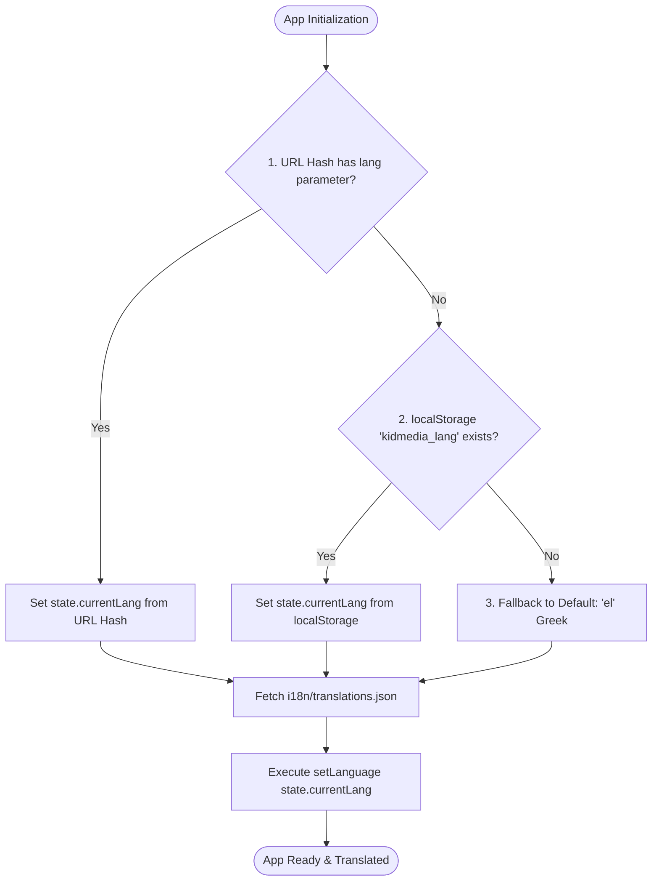

# Kidmedia Educational Web Apps — Internationalization (i18n) & Language Standards

This document defines the mandatory specification and architectural standard for internationalization (i18n), language configuration workflows, and language selection management across all **Kidmedia** Special Education Web Applications.

---

## 1. Core Philosophy & Initial Project Workflow

### 1.1 Mandatory Initial Prompting Workflow
Before initiating development or generating project templates for any new Kidmedia web application, the AI agent / developer **must ask the user** to define the project's language scope:

> **Project Setup Prompt**:
> *"Is this application targeting the standard 24 EU Languages set, or does it require a custom/global language set for non-EU regions?"*

- **Default Choice (24 EU Languages)**: If the user selects the standard EU set, the application automatically implements all 24 official European Union languages.
- **Custom Choice**: If the user selects a custom language set, the AI agent / developer **must immediately issue a follow-up request** asking the user to specify the exact list of target languages (ISO codes and native names) required for the project.

### 1.2 Fundamental i18n Principles
1. **Zero Hardcoded Strings**: All user-facing text, labels, button captions, placeholders, tooltips, and dynamic announcements must reside exclusively within the translation file. Hardcoding UI strings in HTML or JavaScript files is strictly prohibited.
2. **Instant Runtime Switching**: Language changes occur dynamically in memory and update the DOM immediately without requiring a page refresh or reload.
3. **Accessibility First**: Language selection elements must feature high visual contrast, distinct boundaries, and fully switch-scannable interface components compatible with Special Education motor-accessibility requirements.

---

## 2. Language Sets Architecture

### 2.1 Default 24 EU Languages Set
For standard EU-targeted projects, `i18n/translations.json` must support all **24 official languages of the European Union**:

| ISO Code | Native Language Name | English Name | Flag Icon |
|:---:|:---|:---|:---:|
| `el` | Ελληνικά | Greek | 🇬🇷 |
| `en` | English | English | 🇬🇧 |
| `sl` | Slovenščina | Slovenian | 🇸🇮 |
| `fr` | Français | French | 🇫🇷 |
| `de` | Deutsch | German | 🇩🇪 |
| `es` | Español | Spanish | 🇪🇸 |
| `it` | Italiano | Italian | 🇮🇹 |
| `pt` | Português | Portuguese | 🇵🇹 |
| `nl` | Nederlands | Dutch | 🇳🇱 |
| `pl` | Polski | Polish | 🇵🇱 |
| `ro` | Română | Romanian | 🇷🇴 |
| `sv` | Svenska | Swedish | 🇸🇪 |
| `da` | Dansk | Danish | 🇩🇰 |
| `fi` | Suomi | Finnish | 🇫🇮 |
| `cs` | Čeština | Czech | 🇨🇿 |
| `hu` | Magyar | Hungarian | 🇭🇺 |
| `sk` | Slovenčina | Slovak | 🇸🇰 |
| `bg` | Български | Bulgarian | 🇧🇬 |
| `hr` | Hrvatski | Croatian | 🇭🇷 |
| `lt` | Lietuvių | Lithuanian | 🇱🇹 |
| `lv` | Latviešu | Latvian | 🇱🇻 |
| `et` | Eesti | Estonian | 🇪🇪 |
| `mt` | Malti | Maltese | 🇲🇹 |
| `ga` | Gaeilge | Irish | 🇮🇪 |

### 2.2 Custom / Global Language Sets
When a project requires non-EU or custom global languages (e.g. `zh` Chinese, `ja` Japanese, `ar` Arabic, `tr` Turkish, `sq` Albanian), the developer defines the specified language list in `i18n/translations.json`. The i18n core engine operates identically regardless of whether 2, 5, or 24 languages are defined.

---

## 3. Translation Data Architecture

### 3.1 Standard File Path & Format
- **Path**: `i18n/translations.json`
- **Format**: Structured JSON file indexed at the top level by ISO two-letter language codes (`el`, `en`, `fr`, etc.).

### 3.2 JSON Schema Structure
```json
{
  "el": {
    "app_title": "Δίνουμε ρέστα σε ευρώ",
    "setup_title": "Ρυθμίσεις Δραστηριότητας",
    "btn_play": "Παίξε",
    "btn_print": "Εκτύπωση",
    "btn_share": "Διαμοιρασμός",
    "btn_validate": "Επικύρωση",
    "score_congrats": "Συγχαρητήρια!",
    "score_send": "Στείλε το Σκορ",
    "score_retry": "Παίξε Ξανά",
    "input_email_placeholder": "Εισάγετε email δασκάλου..."
  },
  "en": {
    "app_title": "Euro Change Calculator",
    "setup_title": "Activity Setup",
    "btn_play": "Play",
    "btn_print": "Print",
    "btn_share": "Share",
    "btn_validate": "Validate",
    "score_congrats": "Congratulations!",
    "score_send": "Send Score",
    "score_retry": "Play Again",
    "input_email_placeholder": "Enter teacher email..."
  }
}
```

### 3.3 HTML DOM Binding Conventions
To enable automated DOM text binding, elements use data attributes:
- `data-i18n="key"`: Replaces the element's `textContent` with the translated text.
- `data-i18n-placeholder="key"`: Replaces input/textarea `placeholder` text.
- `data-i18n-title="key"`: Replaces element `title` or tooltip attribute.

#### HTML Example:
```html
<h1 data-i18n="setup_title">Ρυθμίσεις Δραστηριότητας</h1>
<input type="email" id="teacherEmail" data-i18n-placeholder="input_email_placeholder" />
<button id="btnPlay" class="btn-glossy btn-purple" data-i18n="btn_play">Παίξε</button>
```

---

## 4. Language Resolution & State Persistence

### 4.1 State Object Specification (`js/state.js`)
The application's active language state is maintained inside the central global state object:

```javascript
export const state = {
    currentLang: 'el',       // Currently active ISO 639-1 code
    translations: {},        // Loaded JSON translation data object
    // ...other state properties
};
```

### 4.2 Initialization & Resolution Precedence
Upon application startup (`main.js` execution), the system resolves `state.currentLang` strictly according to the following 3-tier hierarchy:



1. **Tier 1 — URL Hash Parameter**: If the URL contains an explicit language code (e.g., `#lang=fr` or encoded parameter position), it overrides all saved user preferences.
2. **Tier 2 — Browser `localStorage`**: If no URL language parameter exists, read `localStorage.getItem('kidmedia_lang')`.
3. **Tier 3 — Default Fallback**: If `localStorage` is empty or invalid, fallback to **Greek (`el`)**.

### 4.3 Persistence Execution
Whenever the user selects a new language via the language modal:
1. `state.currentLang` is updated with the selected language code.
2. `localStorage.setItem('kidmedia_lang', langCode)` persists the choice across future browser sessions.
3. `setLanguage(langCode)` updates all DOM elements dynamically.
4. The Language Selector Modal **closes automatically** immediately upon flag selection.

---

## 5. Language Selector UI Specifications

### 5.1 Floating Language Button
- **Placement**: Fixed at top-right corner of screen (`position: fixed; top: 1rem; right: 1rem; z-index: 50`).
- **Appearance**: Circular or rounded-rect button with glossy aesthetic, displaying the flag icon of `state.currentLang`.
- **Accessibility & Scanning**: Included in primary scannable elements when scanning mode is active.
- **Print Rule**: Must include CSS class `no-print` so it is hidden during PDF generation or printing.

### 5.2 Responsive Language Modal Overlay
Clicking the Floating Language Button opens a centered modal dialog with the following layout standards:

- **Backdrop**: Fullscreen semi-transparent overlay with glassmorphism blur (`backdrop-filter: blur(8px); background: rgba(0, 0, 0, 0.5)`).
- **Centering & Sizing**: The flag grid container is **strictly centered on the screen**, fully responsive, and sized to ensure all flags fit neatly within the viewport height without scrolling (`max-h-screen`, `overflow-hidden`).
- **Grid Layout Constraints**:
  - **Desktop / Laptop View**: Arranged in **4 rows x 6 columns** (24 flags total).
  - **Mobile View**: Arranged in **3 columns** (3 cols x 8 rows) to fit narrow screen widths while keeping flag touch targets clear and readable.
- **Flag Visual Standards**:
  - **Uniform Dimensions**: Every flag button must share identical height, width, and aspect ratio.
  - **Symmetrical Spacing**: Equal grid gaps (`gap-3` or `gap-4`) preventing flags from touching.
  - **Mandatory Dark Blue Border**: All flag thumbnails must feature a solid **dark blue border** (`#1e3a8a`, `border-2 border-[#1e3a8a]`). This ensures flags containing white sections (e.g., Greece 🇬🇷, Poland 🇵🇱, Finland 🇫🇮) have crisp, clearly visible edges against light modal backgrounds.
  - **Interactive States**: Smooth hover scale (`transform: scale(1.08)`), active press response, and distinct focus ring for keyboard/switch accessibility.
- **Modal Close Logic**:
  - **Automatic Closing**: Clicking/tapping any language flag immediately sets the language, translates the interface, and **automatically closes the modal window**.
  - **Cancel Action**: A secondary close button ("X" or "Cancel") and backdrop-click handler dismiss the modal without altering language settings.

---

## 6. Reference UI Layout Templates

The responsive grid architecture for the language selection modal is modeled directly after the official Kidmedia UI layout design templates:

### 6.1 Laptop / Desktop Grid Specification (4 Rows x 6 Columns)
In wide viewport environments (laptops/desktops), the modal lays out 24 flags in a 6-column, 4-row grid centered within the screen without scrolling.

-laptop.png)

### 6.2 Mobile Grid Specification (3 Columns x 8 Rows)
In mobile portrait viewport environments, the modal automatically adapts its layout to a **3-column grid** (3 columns x 8 rows) to display all flag selections cleanly without horizontal overflow.

-mobile.png)

---

## 7. Reference Implementation Snippets

### 7.1 Translation Manager Module (`js/translations.js`)

```javascript
import { state } from './state.js';

/**
 * Initializes translations by fetching i18n/translations.json
 * and resolving initial language based on URL hash -> localStorage -> default ('el').
 */
export async function initTranslations() {
    try {
        const response = await fetch('i18n/translations.json');
        if (!response.ok) throw new Error(`HTTP error! status: ${response.status}`);
        state.translations = await response.json();
        
        const initialLang = resolveInitialLanguage();
        setLanguage(initialLang);
    } catch (error) {
        console.error('Failed to load translations:', error);
    }
}

/**
 * Resolves initial language code following strict precedence rules.
 */
function resolveInitialLanguage() {
    // Tier 1: URL Hash check (e.g. #lang=en or hash params)
    const hash = window.location.hash.slice(1);
    const hashParams = new URLSearchParams(hash);
    const hashLang = hashParams.get('lang');
    if (hashLang && state.translations[hashLang]) {
        return hashLang;
    }
    
    // Tier 2: localStorage check
    const savedLang = localStorage.getItem('kidmedia_lang');
    if (savedLang && state.translations[savedLang]) {
        return savedLang;
    }
    
    // Tier 3: Default fallback
    return 'el';
}

/**
 * Sets current language, updates state, persists choice, updates DOM, and updates floating button flag.
 * @param {string} langCode - ISO language code
 */
export function setLanguage(langCode) {
    if (!state.translations[langCode]) {
        console.warn(`Language '${langCode}' not supported. Falling back to 'el'.`);
        langCode = 'el';
    }
    
    state.currentLang = langCode;
    localStorage.setItem('kidmedia_lang', langCode);
    document.documentElement.lang = langCode;
    
    const langDict = state.translations[langCode];
    
    // Update innerText / textContent for elements with data-i18n
    document.querySelectorAll('[data-i18n]').forEach(elem => {
        const key = elem.getAttribute('data-i18n');
        if (langDict[key]) {
            elem.textContent = langDict[key];
        }
    });
    
    // Update placeholders for inputs with data-i18n-placeholder
    document.querySelectorAll('[data-i18n-placeholder]').forEach(elem => {
        const key = elem.getAttribute('data-i18n-placeholder');
        if (langDict[key]) {
            elem.placeholder = langDict[key];
        }
    });

    // Update dynamic title attributes with data-i18n-title
    document.querySelectorAll('[data-i18n-title]').forEach(elem => {
        const key = elem.getAttribute('data-i18n-title');
        if (langDict[key]) {
            elem.title = langDict[key];
        }
    });
    
    // Update floating language button icon/flag indicator
    updateLanguageButtonUI(langCode);
}

/**
 * Updates floating button visual flag indicator.
 */
function updateLanguageButtonUI(langCode) {
    const currentFlagElem = document.getElementById('currentLangFlag');
    if (currentFlagElem) {
        currentFlagElem.textContent = getFlagEmoji(langCode);
    }
}

/**
 * Helper to map language ISO code to Flag Emoji
 */
function getFlagEmoji(langCode) {
    const flags = {
        el: '🇬🇷', en: '🇬🇧', sl: '🇸🇮', fr: '🇫🇷', de: '🇩🇪',
        es: '🇪🇸', it: '🇮🇹', pt: '🇵🇹', nl: '🇳🇱', pl: '🇵🇱',
        ro: '🇷🇴', sv: '🇸🇪', da: '🇩🇰', fi: '🇫🇮', cs: '🇨🇿',
        hu: '🇭🇺', sk: '🇸🇰', bg: '🇧🇬', hr: '🇭🇷', lt: '🇱🇹',
        lv: '🇱🇻', et: '🇪🇪', mt: '🇲🇹', ga: '🇮🇪'
    };
    return flags[langCode] || '🇬🇷';
}
```

### 7.2 Language Selection Modal Component HTML Structure

```html
<!-- Floating Language Selector Button (Top-Right, Fixed, Excluded from Print) -->
<button id="langSelectBtn" class="fixed top-4 right-4 z-50 p-2 bg-white/90 backdrop-blur-md rounded-full shadow-lg border-2 border-[#1e3a8a] hover:scale-105 transition-transform no-print" aria-label="Select Language">
    <span id="currentLangFlag" class="text-2xl">🇬🇷</span>
</button>

<!-- Responsive Language Selector Modal Overlay -->
<div id="langModal" class="hidden fixed inset-0 z-50 flex items-center justify-center bg-black/50 backdrop-blur-sm p-4 no-print overflow-hidden">
    <div class="relative w-full max-w-3xl bg-white rounded-2xl p-6 shadow-2xl flex flex-col items-center max-h-[90vh]">
        
        <!-- Modal Header -->
        <div class="w-full flex justify-between items-center mb-4">
            <h2 class="text-xl font-bold text-gray-800" data-i18n="select_language">Επιλογή Γλώσσας / Select Language</h2>
            <button id="closeLangModalBtn" class="text-gray-400 hover:text-gray-600 text-2xl font-bold p-1">&times;</button>
        </div>
        
        <!-- Responsive Flag Grid Container: 4x6 on Laptop (grid-cols-6), 3 Columns on Mobile (grid-cols-3) -->
        <div id="flagGridContainer" class="w-full grid grid-cols-3 sm:grid-cols-6 gap-3 sm:gap-4 overflow-y-auto py-2 justify-items-center">
            <!-- Dynamically populated flag buttons (each with dark blue border #1e3a8a) -->
        </div>

    </div>
</div>
```

---

## 8. Verification Checklist for New Applications

Before releasing any Kidmedia web application, verify compliance with the i18n standard using the checklist below:

### 8.1 Initial Project Prompting & Scope Check
- [ ] User was prompted at initial setup to choose between **Default 24 EU Languages** and **Custom/Global Language Set**.
- [ ] If Custom Language Set was chosen, user was prompted to explicitly list all required target languages for the project.

### 8.2 Translation File Validation
- [ ] **Standard 24 EU Languages Project**: File `i18n/translations.json` exists and includes translation dictionaries for all **24 official EU languages**.
- [ ] **Custom Language Set Project**: File `i18n/translations.json` exists and includes translation dictionaries for all **custom languages explicitly specified by the user** for that project.

### 8.3 Implementation & Visual Standards Verification
- [ ] No hardcoded text strings exist in `index.html` or `js/*.js` files (all UI text uses `data-i18n` attributes).
- [ ] Initial language loads following precedence: **URL Hash** -> **`localStorage`** -> **Greek `el`**.
- [ ] Floating language button is fixed in top-right corner, shows current flag, and includes class `no-print`.
- [ ] Language Modal is responsive, centered on screen, and displays all flags without requiring page scroll.
- [ ] Grid layout adapts correctly (**4 rows x 6 cols** on desktop/laptop, **3 columns x 8 rows** on mobile portrait).
- [ ] All flag icons/thumbnails feature a mandatory **dark blue border (`#1e3a8a`)** to bound white flag edges.
- [ ] Clicking any flag changes language dynamically across DOM, saves choice to `localStorage`, and **automatically closes modal immediately**.
