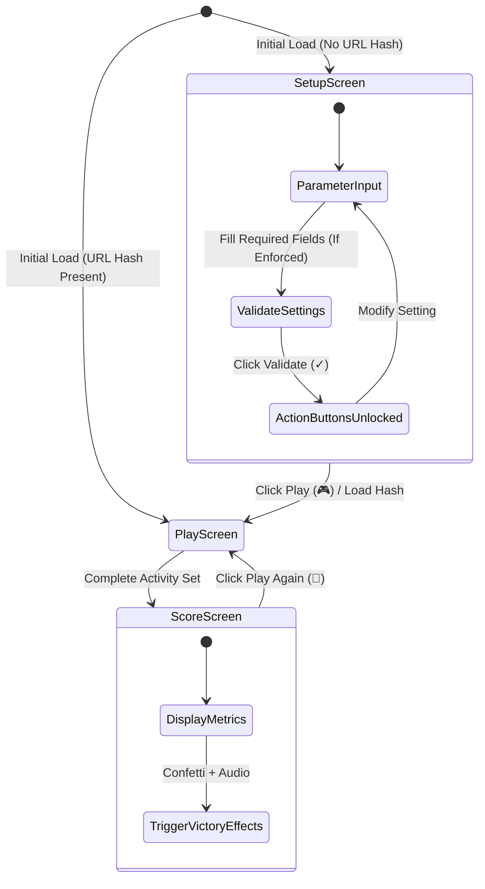

# Kidmedia Educational Web Apps — Application Screens Architecture & UI Component Standard

> **Document Status**: Mandatory Architectural Reference  
> **Target Audience**: Developers, UI/UX Designers, Special Education Technologists  
> **Scope**: Screen layout lifecycle, UI component behaviors, Draggable Numpad specification, and victory reward engines across all Kidmedia web applications.

---

## 1. Overview & Screen Lifecycle

Kidmedia Special Education Web Applications follow a **3-Screen Architecture Paradigm**:
1. **Setup Screen (Teacher Configuration Mode)**: Initial state for parametrizing activity rules, accessibility settings, and generating shareable links.
2. **Play Screen (Interactive Activity Area)**: Student-facing interactive viewport with responsive layout and optional interactive Numpad.
3. **Score Screen (Feedback & Summary Area)**: End-of-activity screen displaying performance metrics, certificate export, mail feedback, and victory animations. *(Note: Non-gamified utility apps like Readers omit the Score Screen).*



### 1.1 Pre-Implementation Feature Selection Protocol

> [!IMPORTANT]
> **General Framework Notice**: This document outlines the master architectural capabilities of Kidmedia screens. Individual application requirements and specific UI features must be tailored to the pedagogical nature of each app.

Before beginning development or generating code for any Kidmedia application, the developer or AI assistant **must conduct an initial requirements discussion with the user** to explicitly declare and select the required feature set:

1. **Screen Scope**: Determine whether a Score Screen is needed (for games/quizzes) or omitted (for reading/utility tools).
2. **Setup Validation**: Determine whether the Setup Screen requires a Validate (✓) button before unlocking action buttons (Play, Print, Share), or if buttons should be unlocked immediately.
3. **Numpad Component**: Confirm whether the Draggable Numpad is required (for mathematics and numeric input apps) or excluded.
4. **Reward Engines**: Select applicable completion reward engines (Canvas Confetti, 20 Emoji Particle Presets, HTML5 Audio / Web Audio API synth tones).
5. **Domain Layout**: Define custom domain-specific controls, game grids, or activity widgets for the Play Screen.

---

## 2. Setup Screen Architecture (Teacher Configuration)

### 2.1 Screen Purpose & Layout
The Setup Screen is the control panel where teachers adjust pedagogical parameters before handing the activity to the student. It is the **only screen** that displays official Kidmedia branding.

* **Branding & Header**:
  * Displays the official Kidmedia logo (`assets/images/Kidmedia-logo.png`).
  * Logo must be wrapped in an anchor: `<a href="https://kidmedia.eu/" target="_blank" rel="noopener noreferrer">`.
  * Hover effect: `transform: scale(1.05); transition: transform 0.2s ease;`.
* **UI Font**: Standardized interface font `Verdana, sans-serif` (or fallback `Lexend`).

### 2.2 Settings Categories & Control Inputs

Settings are organized into distinct UI groups:

| Category | Setting | Control Type | Values / Constraints |
|---|---|---|---|
| **Accessibility** | Scanning Mode | Toggle Switch | `true` / `false` |
| **Accessibility** | Scanning Speed | Dropdown Select | Configurable range `0.5s` to `7.0s` (500ms – 7000ms) |
| **Reporting** | Teacher Email | Input `type="email"` | Valid email format string (optional/mandatory per app) |
| **Pedagogical** | Domain Settings | Radios / Checkboxes / Selects | App-specific (e.g., number ranges, difficulty level, speech rate) |
| **External Content** | Google Sheets Integration | Input `type="url"` + Link | CSV URL input + direct link to open user Google Sheet |

### 2.3 Validation Engine (Validate ✓ Button)

* **Validation Requirement**: Every application specification defines whether the Validate button is enforced or bypassed. For complex multi-parametric apps, validation is mandatory; for simple utility tools (e.g., Reader), validation can be bypassed automatically.
* **Initial State**: Validate button (✓) starts disabled (`.btn-gray`, `opacity: 0.6`, `cursor: not-allowed`).
* **Validation Logic**: Evaluates all mandatory input fields. Once valid parameters are provided, clicking Validate (✓):
  1. Sets internal state `state.isValidated = true`.
  2. Enables and unhides the **Action Buttons** (Play, Print, Share).
* **Reset Trigger**: Modifying any configuration input automatically sets `state.isValidated = false` and re-locks Action Buttons.

### 2.4 Action Buttons (Post-Validation)

Once validated, four primary action buttons appear using rounded, glossy styling (`.btn-glossy`, `rounded-full`):

```html
<!-- Action Buttons Container -->
<div id="action-buttons-group" class="flex flex-wrap gap-4 justify-center">
  <!-- Play Button -->
  <button id="btn-play" class="btn-glossy btn-purple px-6 py-4 text-xl font-bold rounded-full">
    🎮 <span data-i18n="btn_play">Play</span>
  </button>
  
  <!-- PDF / Print Button (Where Applicable) -->
  <button id="btn-print" class="btn-glossy btn-blue px-6 py-4 text-xl font-bold rounded-full">
    📄 <span data-i18n="btn_print">Print Worksheet</span>
  </button>
  
  <!-- Copy Link Button -->
  <button id="btn-copy" class="btn-glossy btn-green px-6 py-4 text-xl font-bold rounded-full">
    📋 <span data-i18n="btn_copy">Copy Link</span>
  </button>

  <!-- Share / Email Button -->
  <button id="btn-share" class="btn-glossy btn-teal px-6 py-4 text-xl font-bold rounded-full">
    📤 <span data-i18n="btn_share">Share / Email</span>
  </button>
</div>
```

* **Action Mechanisms**:
  * **Play**: Launches the interactive activity directly in Play Mode.
  * **Print / PDF**: Generates the printable worksheet or PDF export.
  * **Copy Link**: Copies the stateless student URL hash directly to clipboard with instant visual confirmation (toast notification / button checkmark ✓).
  * **Share / Email (Native Web Share & Mailto Integration)**:
    * Uses the native **Web Share API** (`navigator.share()`) when supported to invoke the device's native sharing sheet (Viber, WhatsApp, Google Classroom, MS Teams, Email).
    * Automatically falls back to a pre-filled `mailto:` email template when `navigator.share()` is unavailable (e.g., older desktop environments).

---

## 3. Play Screen Architecture (Interactive Activity Area)

### 3.1 Layout & Responsive Grid Structure
The Play Screen hosts the interactive learning area:
* **Top Navigation Toolbar**: Displays a simple back button (`← Settings`) and active exercise metrics (e.g., progress counter `3 / 10`). Marked with `.no-print`.
* **Viewport Grid**: Responsive layout adapting to device screen aspect ratios:
  * Desktop / Tablet Landscape: Main exercise area centered, Numpad positioned adjacent to target inputs.
  * Mobile Portrait: Stacked single-column layout prioritizing large touch targets.

---

## 4. Interactive Draggable Numpad Specification

Applications involving numeric entry (e.g., Mathematics, Counting, Currency calculations) utilize a standardized **Draggable Numpad** component.

```
+-----------------------------------+  <-- Top Drag Strip (.numpad-drag-strip)
| 7 | 8 | 9 |   C   |               |
|---|---|---|-------|               |
| 4 | 5 | 6 |   ←   |               |
|---|---|---|-------|               |
| 1 | 2 | 3 |  SUB  |               |
|-------|---|  MIT  |               |
|   0   | . |   ✓   |               |
+-----------------------------------+  <-- Bottom Drag Strip (.numpad-drag-strip)
```

### 4.1 Key Matrix & Layout
* **Digit Keys**: `0`, `1`, `2`, `3`, `4`, `5`, `6`, `7`, `8`, `9` (and optional decimal `.`).
* **Control Keys**:
  * `C` (Clear): Resets current input buffer to empty.
  * `←` (Backspace): Deletes the last entered digit.
  * `Submit` / `✓`: Validates and submits the entered answer.

### 4.2 Draggable Mechanism
* **Drag Handles**: Dual thin drag strips located at the top and bottom of the Numpad (`.numpad-drag-strip`, `cursor: move`, touch-action: none).
* **Pointer Events**: Listens to `pointerdown`, `pointermove`, and `pointerup` for smooth touch and mouse positioning across the viewport.
* **State Persistence**: Position coordinates (`top`, `left`) are stored in `state.numpadPosition` during the session.

### 4.3 Scanning Mode Behavior & Repositioning
* **Always Draggable**: The Numpad retains manual drag capabilities even when Scanning Mode is active.
* **Automatic Positioning**: Upon moving to a new math question in Scanning Mode, the Numpad automatically smooth-scrolls/repositions adjacent to the active problem target without overlapping the question element.
* **Multi-Level Scanning Integration**:
  * **Level 1**: Activity targets (e.g., selecting an equation).
  * **Level 2**: Focus locks to the Numpad keys for numeric entry.
* **Smart Key Filtering**:
  * Once the student has entered the required number of digits for the current problem (e.g., 2 digits for an answer of `18`), the scanning cycle automatically filters key focus exclusively to `Submit`, `C`, and `←`.
  * Digits `0–9` are bypassed until `C` or `←` is pressed, preventing over-entry errors.

---

## 5. Score Screen & Victory Reward Architecture

Upon completing an activity set, the application transitions to the **Score Screen**.

### 5.1 Screen Structure & Visual Components

```
+-------------------------------------------------------+
|                 Сυγχαρητήρια! (Title)                  |
|                                                       |
|             +---------------------------+             |
|             |      Score Crest Image    |             |
|             |   Score-Crest-1024b.png   |             |
|             |                           |             |
|             |     Overlay Score: 10/10  |             |
|             +---------------------------+             |
|                                                       |
|             Errors Summary & Metrics Text             |
|                                                       |
|  [ 🔄 Play Again ]  [ ✉️ Send Score ]  [ 🖨️ Print ]   |
+-------------------------------------------------------+
```

* **Header Title**: Translated "Congratulations!" ("Συγχαρητήρια!").
* **Central Crest**: Displays official Score Crest graphic (`assets/images/Score-Crest-1024b.png`) with dynamic score overlay text (e.g., `100%`, `9/10`).
* **Performance Summary**: Bulleted breakdown displaying total correct answers, total attempts, and specific error taxonomy notes.

### 5.2 Interactive Action Buttons

1. 🔄 **Play Again** (`.btn-purple`): Generates a new randomized exercise set, resets activity state, and transitions directly back to Play Screen.
2. ✉️ **Send Score** (`.btn-green`):
   * **Visibility**: Displayed **ONLY** if `state.teacherEmail` contains a valid email address.
   * **Action**: Launches native mail client via `mailto:` pre-filling:
     * Subject: `[App Title] - Student Activity Score`
     * Body: Detailed breakdown including score percentage, correct/incorrect counts, error log, and execution timestamp.
3. 🖨️ **Print Certificate / Summary** (`.btn-blue`):
   * Opens print preview window / dynamically generated achievement certificate for student reward records.

### 5.3 Victory Reward Engine (Visual & Audio)

To maximize positive reinforcement for special education students, every gamified application includes a dual visual and audio reward system:

```javascript
// Victory Reward Controller Pattern
export function triggerVictoryRewards() {
    // 1. Visual Reward Engine: Canvas Confetti
    if (typeof confetti === 'function') {
        confetti({
            particleCount: 120,
            spread: 70,
            origin: { y: 0.6 }
        });
    }

    // 2. Visual Reward Engine: 20 Emoji Particle Sequences
    triggerEmojiParticleShower();

    // 3. Audio Reward Engine: Sound FX
    playVictorySound();
}
```

#### Visual Reward Engine
* **Canvas Confetti**: Integration with `canvas-confetti` library for smooth particle physics cascades.
* **Emoji Particle Pool**: 20 distinct animated emoji particle sequences (star showers, trophies, balloons, smiley bursts) cycling through `#victory-anim-container` (`position: fixed`, `inset: 0`, `pointer-events: none`, `z-index: 9998`).

#### Audio Reward Engine
* **HTML5 Audio Fallback**: Plays high-quality audio files (`assets/audio/victory.mp3` or `.wav`).
* **Web Audio API Synthesizer**: Built-in tone generator synthesizing a celebratory musical chord progression (e.g., C5 - E5 - G5 - C6 arpeggio) ensuring zero external media dependency for offline operation.

---

## 6. Implementation Verification Checklist

- [ ] **Initial Requirements Discussion**:
  - [ ] Interactive discussion conducted with user to declare required feature set (Screen scope, Validate button, Numpad, Reward engines).
- [ ] **Setup Screen**:
  - [ ] Kidmedia logo present with `target="_blank"` link to `https://kidmedia.eu/`.
  - [ ] Verdana font family applied across UI elements.
  - [ ] Configurable Validate (✓) button logic implemented (if required).
  - [ ] Action buttons (Play, Print, Share) unlocked post-validation.
  - [ ] Share button generates semicolon-separated URL Hash.
- [ ] **Play Screen**:
  - [ ] Navigation header marked with `.no-print`.
  - [ ] Responsive grid layout configured for mobile/desktop.
- [ ] **Draggable Numpad** (If Required):
  - [ ] Contains 0–9, `C`, `←`, and `Submit`.
  - [ ] Top and bottom thin drag handles operational for touch and mouse.
  - [ ] Automatically repositions adjacent to target question during Scanning Mode.
  - [ ] Remains draggable even while Scanning Mode is active.
  - [ ] Implements smart key filtering (restricting to Submit/C/← after max digits entered).
- [ ] **Score Screen & Victory System** (If Required):
  - [ ] Score Crest image (`Score-Crest-1024b.png`) displayed with overlay text.
  - [ ] "Play Again" button re-randomizes and restarts exercise.
  - [ ] "Send Score" mailto button visible only when teacher email exists.
  - [ ] "Print Certificate / Summary" button operational.
  - [ ] Victory animation combines `canvas-confetti` and 20 emoji particle presets.
  - [ ] Audio system plays victory sound via HTML5 Audio and Web Audio API synthesizer.
