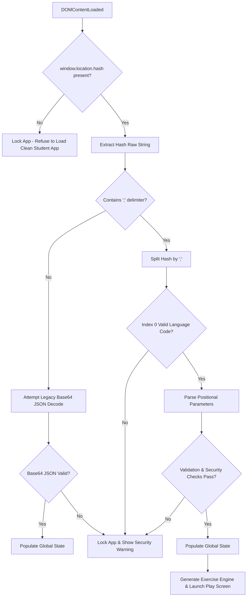

# 05. Link Architecture, Security Model, & Teacher Email Integration

This master specification defines the client-side **Stateless Link Architecture**, **Positional Parameter Schema**, **Dual Standalone Export & Security Locking Model** (Teacher Protected Edition vs. Student Free Edition), and **Teacher Email Communication Protocol** across all Kidmedia Educational Web Applications.

---

## 1. Executive Summary & Architectural Vision

### 1.1 The Core Requirement
In special education and differentiated instruction, every student operates at a unique cognitive, sensory, and motor skill level:
- Student A might require addition up to 10 without carry-over, rendered horizontally with single-switch Scanning Mode (2.0s interval).
- Student B might require vertical multiplication with two-digit operands using standard touch interface.

Crucially, **students must never encounter setup screens, configuration dropdowns, or complex log-in forms**. Opening an assigned exercise must immediately launch the interactive activity with zero friction.

### 1.2 The "URL as Database" Paradigm
To fulfill this requirement without backend infrastructure, user databases, or persistent server sessions, Kidmedia applications use a **100% Stateless Client-Side Architecture**:
1. The teacher configures exercises on the **Teacher Edition (Setup Screen)**.
2. Clicking **"Create URL"** / **"Share"** serializes the entire state object into a compact string appended to the URL fragment (`window.location.hash`).
3. When the student opens the URL, it routes to the **Student Edition (Free/Public Folder)**, deserializes the hash, builds the game engine, locks the interface, and launches directly into **Play Mode**.

---

## 2. Positional Parameter Schema (`#[lang];[p0];[p1]...;[pN]`)

### 2.1 Canonical Hash Structure
All Kidmedia applications conform to a semicolon-separated positional parameter schema:

```
https://apps.kidmedia.eu/student/[app-slug]/#[lang];[p0];[p1];[p2]...;[pN]
```

| Index | Parameter | Type / Format | Example | Description |
|---|---|---|---|---|
| `0` | `lang` | String (2-letter ISO) | `el`, `en`, `de` | Active application language code |
| `1` | `p0` | String / Enum | `add`, `sub` | Primary domain operation/category |
| `2` | `p1` | String / Enum | `hoz`, `ver` | UI layout mode |
| `3` | `p2` | Integer | `12`, `24` | Total exercise/item count |
| `4..N-5` | `p3..pN-5` | Mixed | `1;10;1;10;2;20` | Domain-specific min/max limits & flags |
| `N-4` | `scanOn` | Boolean (`0` / `1`) | `1` | Scanning accessibility mode on/off |
| `N-3` | `scanSpeed` | Integer (ms) | `2000` | Scanning switch interval in milliseconds |
| `N-2` | `teacherEmail` | String (URI encoded) | `teacher%40school.gr` | Pre-filled teacher email address (or empty string `_`) |
| `N-1` | `timestamp` | Base36 String *(Sub only)* | `4k9z2` | Expiration Unix timestamp ($T_2$) |
| `N` | `sig` | Base36 String *(Sub only)* | `8a3b` | SHA-256 HMAC security signature |

> [!NOTE]
> Empty optional string parameters (such as `teacherEmail` when not specified) are serialized as an underscore `_` to maintain index alignment.

### 2.2 Deserialization & Bootstrapping Logic Flow



### 2.3 Strict Validation, Sanitization, & Fallback Rules
To prevent application crashes or invalid exercise generation from malformed URLs:
1. **Index Verification**: The array length after splitting by `;` must match the exact expected count for that application version.
2. **Type Casting & Bound Checks**:
   - `lang`: Must match one of the 24 EU supported codes. Fallback: `'el'`.
   - Numeric parameters: Must be within domain boundaries (e.g., `count` between `1` and `100`, `scanSpeed` between `1000` and `5000`).
   - Email: Must pass regex validation `^[^\s@]+@[^\s@]+\.[^\s@]+$` or default to empty.
3. **Fallback Execution**: If validation fails in the Teacher Edition, it falls back to default settings. If validation or HMAC verification fails in the Student Edition, the application **locks down immediately** and refuses to render the exercise.

---

## 3. Dual Standalone Export & Security Locking Architecture

Kidmedia commercial applications are exported into **two distinct standalone packages** deployed to separate server directories:

```
                                +-----------------------------------+
                                | Kidmedia App Export Architecture  |
                                +-----------------------------------+
                                                  |
                +---------------------------------+---------------------------------+
                |                                                                   |
                v                                                                   v
  +-----------------------------------+                               +-----------------------------------+
  |   TEACHER EDITION (Protected)     |                               |    STUDENT EDITION (Free/Public)  |
  | Folder: /teacher/[app-slug]/      |                               | Folder: /student/[app-slug]/      |
  +-----------------------------------+                               +-----------------------------------+
  | - Password / Subscription Protected|                               | - Open Access Directory           |
  | - Contains Full Setup UI          |                               | - NO Setup Screen Interface       |
  | - Configures Parameters & Limits   |                               | - Contains Game Engine Only       |
  | - Generates Signed Student Links  |                               | - EXECUTES ONLY WITH VALID HASH   |
  +-----------------------------------+                               +-----------------------------------+
                   |                                                                ^
                   | Generates Signed 7-Day URL                                     |
                   +----------------------------------------------------------------+
                     Target: https://apps.kidmedia.eu/student/[app-slug]/#[hash]
```

### 3.1 Dual Standalone App Export Model

#### 1. Teacher Edition (Protected Directory)
- **Deployment Location**: Uploaded to a subscription-gated, locked server folder (e.g. `/teacher/[app-slug]/`). Access requires active subscription authentication.
- **Functionality**: Contains the complete setup interface (**Setup Screen**), configuration controls, real-time constraint calculation engine, and URL creation tools (**"Create URL"**, **"Email Exercise"**, **"Copy Link"**).
- **Output**: Generates stateless URLs pointing strictly to the **Student Edition** in the public folder.

#### 2. Student Edition (Free / Public Directory)
- **Deployment Location**: Uploaded to an open, publicly accessible server folder (e.g. `/student/[app-slug]/`). Requires no user accounts or passwords.
- **Functionality**: Contains **ONLY** the interactive game environment (**Play Screen** and **Score Screen**). Has zero setup UI elements.
- **Execution Condition**: Engineered to run **STRICTLY AND ONLY IF** loaded with a valid, unexpired timestamp and correct HMAC signature in the URL hash.

---

### 3.2 System Security & Execution Locking Rules

#### Commercial Strategy
Kidmedia operates on a subscription model (€30/year per teacher). Students must play assigned exercises freely without accounts. To prevent unauthorized users from discovering the public Student folder and utilizing premium material for free, the Student Edition incorporates an **Automated Execution Lock**.

#### Enforced Execution Rules

```
                      +------------------------------------------+
                      | Student Edition Entry Check (main.js)   |
                      +------------------------------------------+
                                           |
                +--------------------------+--------------------------+
                |                                                     |
  Hash Present? | NO                                    Hash Present? | YES
                v                                                     v
   +--------------------------+                        +------------------------------+
   |   LOCK APPLICATION       |                        | Verify 7-Day Timestamp &     |
   | - Refuse Execution       |                        | Salted SHA-256 HMAC Sig      |
   | - Render Access Denied   |                        +------------------------------+
   +--------------------------+                                       |
                                            +-------------------------+-------------------------+
                                            | Valid & Unexpired? YES                            | Invalid / Tampered / Expired NO
                                            v                                                   v
                             +------------------------------+                    +------------------------------+
                             |   LAUNCH PLAY MODE           |                    |   LOCK APPLICATION           |
                             | - Render Interactive Game    |                    | - Refuse Execution           |
                             | - Zero Setup UI Access       |                    | - Render Security Error UI   |
                             +------------------------------+                    +------------------------------+
```

##### 1. Clean Launch Lockdown (No Hash)
If a user discovers the public Student directory URL (`https://apps.kidmedia.eu/student/[app-slug]/`) and opens it directly without a hash:
- The app detects `window.location.hash` is missing.
- **Action**: Execution halts immediately. The app renders an **Access Denied Screen**:
  > *"Access Restricted: Please open this application using the specific exercise link provided by your teacher."*

##### 2. Tamper Prevention Lockdown
If a user attempts to modify any part of the URL (e.g., changing exercise rules or altering the Base36 timestamp to extend access):
- The app recalculates the SHA-256 HMAC signature over the payload and timestamp.
- The computed signature fails to match the URL signature (`sig`).
- **Action**: Execution halts immediately. The app renders a **Security Error Screen**:
  > *"Security Error: Link parameters have been altered or corrupted. Access denied."*

##### 3. Expiration Lockdown (7-Day Expiry)
If a student opens a link older than 7 days ($T > T_2$):
- The app decodes timestamp $T_2$ and compares it to current Unix time $T$.
- $T > T_2$ evaluation returns `true`.
- **Action**: Execution halts immediately. The app renders a **Link Expired Screen**:
  > *"Link Expired: This exercise link was active for 7 days. Please request a new link from your teacher."*

---

### 3.3 Technical Implementation of 7-Day Expiration & HMAC Signature

#### 1. Timestamp Generation ($T_2$)
- Current time $T_1 = \text{Math.floor}(\text{Date.now}() / 1000)$ (Unix Timestamp in seconds).
- Expiration time $T_2 = T_1 + (7 \times 86400) = T_1 + 604,800\text{ seconds}$.
- Converted to Base36 alphanumeric representation:
  $$\text{timestamp\_b36} = T_2.\text{toString}(36)$$

#### 2. Salted SHA-256 HMAC Signature ($S$)
$$\text{Payload} = \text{config\_string} + ";" + \text{timestamp\_b36}$$
$$\text{SignatureRaw} = \text{HMAC-SHA256}(\text{Payload}, \text{SECRET\_APPLICATION\_SALT})$$
$$\text{sig\_b36} = \text{SignatureRaw.slice}(0, 8)$$

The generated student hash structure:
```
#[lang];[p0];[p1]...;[pN];[timestamp_b36];[sig_b36]
```

---

### 3.4 Erasmus+ vs Kidmedia.eu Commercial Alignment

| Feature | Erasmus+ Edition (Open Project) | Kidmedia.eu Subscription Edition |
|---|---|---|
| **Export Structure** | Single Standalone Application | Dual Standalone Export (Teacher / Student) |
| **Server Location** | Public Open Directory | Protected `/teacher/` vs Open `/student/` |
| **Link Expiration** | Permanent (No expiration) | Strict 7-Day Time Limit ($T_2$) |
| **Security Signature** | Not Required | Mandatory Salted SHA-256 HMAC |
| **Clean Public URL Launch** | Displays Setup Screen | Application Locks Up (Access Denied) |

---

## 4. Teacher Email Integration (`mailto:` Protocol)

Kidmedia applications integrate native mail client communication via `mailto:` links without requiring any backend mail server API.

```
                    +--------------------------------+
                    |    Kidmedia Application UI     |
                    +--------------------------------+
                               |            |
             +-----------------+            +-----------------+
             | Teacher Setup Screen                           | Student Score Screen
             v                                                v
    [ Email Exercise Link ]                          [ Email Results Button ]
             |                                                |
             v                                                v
  mailto:?subject=...&body=...                     mailto:teacher@school.gr?subject=...
             |                                                |
             +------------------------+-----------------------+
                                      |
                                      v
                       +-----------------------------+
                       | Native OS Mail Client       |
                       | (Outlook / Thunderbird /    |
                       |  Gmail / Apple Mail)        |
                       +-----------------------------+
```

### 4.1 Teacher Setup Screen: Sharing Exercise Link (Web Share API & Email)

#### UI Elements
- **"Copy Link" Button**: Copies the generated student URL directly to clipboard with instant visual feedback.
- **"Share / Email" Button**: Uses native device sharing or falls back to pre-filled email.
- Glossy buttons, rounded styling (`.btn-glossy`, `rounded-full`).

#### Action Mechanism
Clicking **"Share / Email"** first checks for native device sharing via the **Web Share API** (`navigator.share`), allowing instant sharing across installed apps (Viber, WhatsApp, Google Classroom, MS Teams). If unsupported, it gracefully falls back to the native mail client via `mailto:`:

```javascript
async function shareOrEmailExercise(state) {
    const studentShareUrl = generateStudentURL(state);
    const title = t(state.appTitleKey, 'Kidmedia Interactive Exercise');
    const text = t('email.setup.body_short', 'Here is your interactive exercise link:');

    // 1. Attempt Native Web Share API (Mobile, Tablets, Modern OS)
    if (navigator.share) {
        try {
            await navigator.share({
                title: title,
                text: text,
                url: studentShareUrl
            });
            return;
        } catch (err) {
            if (err.name !== 'AbortError') {
                console.warn('Web Share failed, falling back to mailto:', err);
            } else {
                return; // User canceled the share sheet
            }
        }
    }

    // 2. Fallback to Native OS Mail Client (mailto:)
    const subject = encodeURIComponent(t('email.setup.subject', 'New Interactive Exercise Assigned'));
    const bodyText = t('email.setup.body', 
        `Hello,\n\nPlease click the link below to open your assigned exercise:\n\n${studentShareUrl}\n\nNote: This link is active for 7 days.\n\nGood luck!`
    );
    const mailtoUrl = `mailto:?subject=${subject}&body=${encodeURIComponent(bodyText)}`;
    window.location.href = mailtoUrl;
}
```

---

### 4.2 Student Score Screen: Sending Student Results to Teacher

#### UI Element
- **"Email Results" Button**: Rendered on `#score-screen` in the Student Edition.
- **Visibility Rule**: Appears **ONLY if `state.teacherEmail` contains a valid email address**. If `teacherEmail` is empty or `_`, the button is hidden (`display: none`).

#### Data Payload Structure
When the student completes the exercise:
- **Student Name** (if entered/prompted, or default `"Student"`).
- **Total Score / Correct Items** (e.g., `18 / 20`).
- **Accuracy Percentage** (e.g., `90%`).
- **Completion Time** (e.g., `2 min 14 sec`).
- **Mistake Details** (list of incorrect attempts).
- **Exercise Configuration Summary** (Operation, limits, scanning settings).

#### Action Mechanism

```javascript
function sendResultsEmail(state, results) {
    if (!state.teacherEmail || state.teacherEmail === '_') return;

    const subject = encodeURIComponent(
        `[Kidmedia Results] ${t(state.appTitleKey)} - Score: ${results.score}/${results.total}`
    );
    
    const bodyContent = 
`Kidmedia Student Performance Report
------------------------------------
Application: ${t(state.appTitleKey)}
Date: ${new Date().toLocaleString()}

RESULTS SUMMARY:
- Final Score: ${results.score} / ${results.total} (${results.accuracy}%)
- Total Time: ${results.timeFormatted}
- Total Mistakes: ${results.mistakeCount}

EXERCISE SETTINGS:
- Configuration: ${results.configSummary}
- Accessibility: Scanning ${state.scanOn ? 'ON (' + state.scanSpeed + 'ms)' : 'OFF'}

------------------------------------
Generated automatically by Kidmedia Educational Web Apps (https://kidmedia.eu/)`;

    const mailtoUrl = `mailto:${encodeURIComponent(state.teacherEmail)}?subject=${subject}&body=${encodeURIComponent(bodyContent)}`;
    window.location.href = mailtoUrl;
}
```

#### Privacy & Compliance (GDPR / COPPA)
Because `mailto:` opens the local mail client directly:
- Zero student performance data is transmitted to or stored on Kidmedia servers.
- Complete data privacy compliance is maintained by design.

---

## 5. Full JavaScript Reference Module (`link-security.js`)

Below is the production-grade reference implementation for generating student URLs from the Teacher Edition and verifying URLs in the Student Edition:

```javascript
/**
 * link-security.js - Core Link Serialization, HMAC Security & Mail Integration
 */

const SECRET_SALT = 'KIDMEDIA_EDU_SECURE_SALT_2026';
const PUBLIC_STUDENT_BASE_URL = 'https://apps.kidmedia.eu/student/';

export class LinkManager {
    
    /**
     * Called by Teacher Edition to generate 7-day signed Student URL
     */
    static generateStudentURL(state, appSlug) {
        const lang = state.currentLang || 'el';
        const teacherEmail = state.teacherEmail ? encodeURIComponent(state.teacherEmail) : '_';
        
        const params = [
            lang,
            state.op,
            state.layout,
            state.count,
            state.limits.t1Min,
            state.limits.t1Max,
            state.limits.t2Min,
            state.limits.t2Max,
            state.scanOn ? 1 : 0,
            state.scanSpeed,
            teacherEmail
        ];
        
        const configPayload = params.join(';');

        // Add 7-day expiration timestamp
        const expiryUnix = Math.floor(Date.now() / 1000) + (7 * 86400);
        const timestampB36 = expiryUnix.toString(36);
        
        // Generate HMAC signature
        const sig = this.computeHMAC(configPayload + ';' + timestampB36, SECRET_SALT);
        
        const finalHash = `${configPayload};${timestampB36};${sig}`;
        return `${PUBLIC_STUDENT_BASE_URL}${appSlug}/#${finalHash}`;
    }

    /**
     * Called by Student Edition at boot to verify hash and enforce execution lock
     */
    static bootstrapStudentApp(hash) {
        if (!hash || hash.length <= 1) {
            return { success: false, lockReason: 'NO_HASH' };
        }
        
        const rawHash = hash.substring(1);
        
        // Legacy Base64 fallback check
        if (!rawHash.includes(';')) {
            try {
                const jsonString = atob(rawHash);
                const decodedState = JSON.parse(jsonString);
                return { success: true, state: decodedState };
            } catch (e) {
                return { success: false, lockReason: 'TAMPERED' };
            }
        }
        
        const parts = rawHash.split(';');
        if (parts.length < 13) {
            return { success: false, lockReason: 'INVALID_FORMAT' };
        }
        
        const sig = parts.pop();
        const timestampB36 = parts.pop();
        const payload = parts.join(';');
        
        // 1. Verify HMAC Signature
        const expectedSig = this.computeHMAC(payload + ';' + timestampB36, SECRET_SALT);
        if (sig !== expectedSig) {
            return { success: false, lockReason: 'TAMPERED' };
        }
        
        // 2. Verify Expiration
        const expiryUnix = parseInt(timestampB36, 36);
        const currentUnix = Math.floor(Date.now() / 1000);
        if (currentUnix > expiryUnix) {
            return { success: false, lockReason: 'EXPIRED' };
        }
        
        // 3. Return verified state object
        return {
            success: true,
            state: {
                lang: parts[0],
                op: parts[1],
                layout: parts[2],
                count: parseInt(parts[3], 10),
                t1Min: parseInt(parts[4], 10),
                t1Max: parseInt(parts[5], 10),
                t2Min: parseInt(parts[6], 10),
                t2Max: parseInt(parts[7], 10),
                scanOn: parts[8] === '1',
                scanSpeed: parseInt(parts[9], 10),
                teacherEmail: parts[10] === '_' ? '' : decodeURIComponent(parts[10])
            }
        };
    }

    /**
     * Lightweight SHA-256 HMAC implementation (truncated to 8 chars)
     */
    static computeHMAC(message, salt) {
        let hash = 0;
        const combined = message + salt;
        for (let i = 0; i < combined.length; i++) {
            const char = combined.charCodeAt(i);
            hash = ((hash << 5) - hash) + char;
            hash |= 0;
        }
        return Math.abs(hash).toString(36).substring(0, 8);
    }
}
```

---

## 6. Verification & Implementation Checklist

- [ ] All references to BYOD / Google Sheets completely removed.
- [ ] Positional Parameter Schema starts strictly with `[lang]` as element 0 (`#[lang];[p0]...;[pN]`).
- [ ] Apps exported as two autonomous packages: **Teacher Edition** (Protected Folder) and **Student Edition** (Public Folder).
- [ ] Teacher Edition contains full Setup UI; Student Edition contains ONLY Play & Score Screens.
- [ ] Student Edition enforces **System Security Execution Lock**:
  - Clean URL launch without hash -> Application locks up (Access Denied).
  - Tampered URL hash -> Application locks up (Security Error).
  - Expired URL ($T > T_2$) -> Application locks up (Link Expired).
- [ ] Erasmus+ apps remain single public package with permanent open links.
- [ ] Setup Screen contains **"Email Exercise"** button producing pre-filled `mailto:` link.
- [ ] Score Screen contains **"Email Results"** button sending score, accuracy %, time, and mistakes to `teacherEmail` via `mailto:`.
